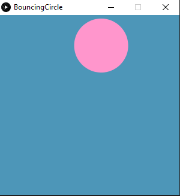
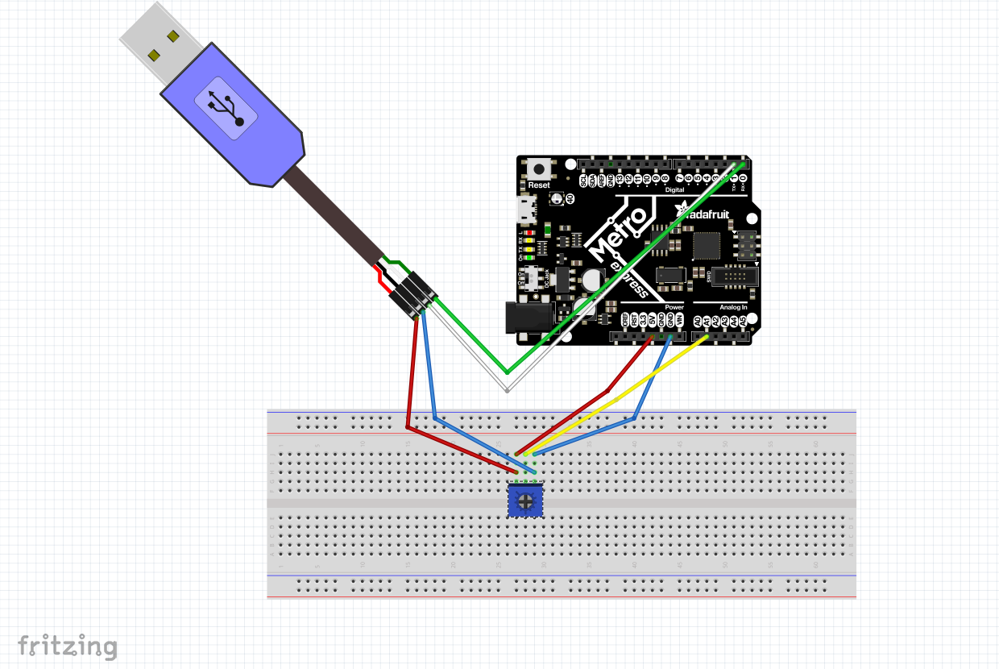
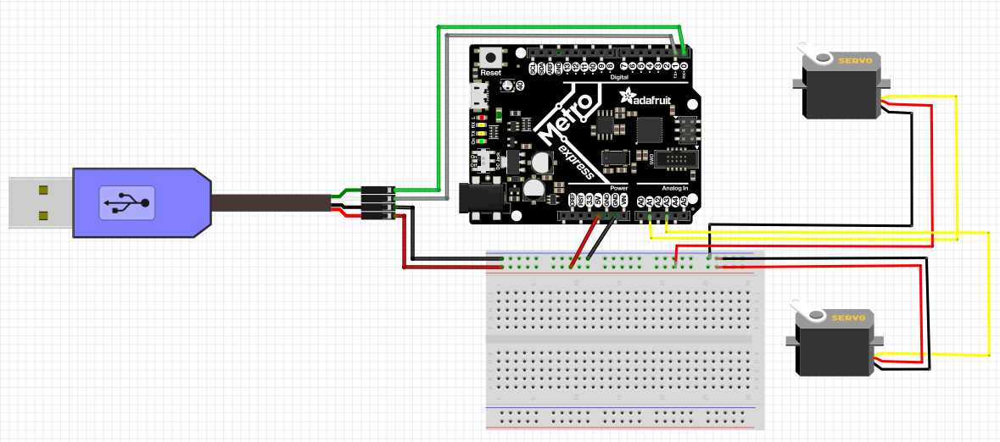

# Advanced-Circuit-Python
#### Although the module is called 'Advanced Circut Python', the assingments entails pairing with a program called Processing.

## Hello World
#### This assignment was based loosly off an episode of The Office, where the entire cast waits during a staff meeting for a box on the TV to fit perfectly into the corner. We had to recreate this, by making a circle bounce around the screen. I learned how to use Processing in order to make graphics and code for them. The code for this assignment can be found above in the folder 'Hello World'. 

## Circuit Python to Processing 
#### In this assignment I learned how to connect Circut Python and Processing by creating a 'speedometer' thats hand moved correlating with the direction the potemtionmeter was turned in the Circut Python code. The code for this assignment can be found above under the titles of 'circutpythontoprocessing' and the processing code can be found in the folder called 'proccesingofcircutpythontoprocessing'.

## Processing to Circuit Python
#### In this assignment I had to once again, link Circuit Python to Processing, but this time the graphics in Processing should show the coordinates of my mouse on the screen. Python in this assignment simply read the data from Processing, and accordingly change the postions of the servos to match. The code for this assigment can be found above under the titles of 'processingtocitcutpython' and in the folder called 'processingofprocessingtocitcutpython'. 

###### code for Processing to Circuit Python, as well as all pictures, credited to Imogen Armstrong